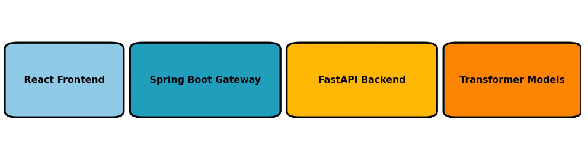

[](https://github.com/abhishekmaity/BhashaMind/actions/workflows/test.yml)

# BhashaMind

# *Bhasha*Mind: A Bengali Language Intelligence Platform


BhashaMind (ভাষাMind) is an open-source Bengali language processing prototype focused on **text summarization** and **zero-shot classification** using state-of-the-art deep learning and LLM technologies. It integrates a full-stack application built with **FastAPI**, **Spring Boot**, and **React**, designed for real-world applications.

## 🌟 Project Highlights

- 🔤 **Low-Resource Bengali NLP**: Tailored for Bengali, one of the least-resourced languages in NLP.
- 🧠 **Transformer-powered**: Uses multilingual LLMs like `xlm-roberta` and optionally fine-tuned `BanglaT5`.
- 🧩 **Microservices Architecture**: Spring Boot API gateway + FastAPI backend + React frontend.
- 🧪 **Full-stack Pipeline**: Data ingestion → Summarization/Classification → Evaluation → UI interaction.

## 🏗️ Architecture



- **Frontend:** ReactJS + TailwindCSS
- **API Gateway:** Java Spring Boot
- **NLP Backend:** Python FastAPI with HuggingFace Transformers
- **Model Training:** PyTorch-based scripts for fine-tuning
- **Dataset:** Placeholder Bengali datasets (summarization/classification)
<small>

## 🧪 Sample Usage

### 🔹 Summarization API
**Request** (`POST /api/summarize`):
```json
{
  "text": "জাতিসংঘের মহাসচিব আন্তোনিও গুতেরেস বলেছেন, জলবায়ু পরিবর্তনের প্রভাব এখন বৈশ্বিক সংকটের রূপ নিয়েছে। আফ্রিকা, এশিয়া ও লাতিন আমেরিকার বহু দেশ ভয়াবহ খরার সম্মুখীন হচ্ছে, যেখানে খাদ্য ও পানির তীব্র সংকট দেখা দিয়েছে। গুতেরেস উন্নত দেশগুলোকে কার্বন নিঃসরণ কমাতে জরুরি পদক্ষেপ নেওয়ার আহ্বান জানান।"
}
```
**Response**:
```json
{
  "summary": "জাতিসংঘ মহাসচিব গুতেরেস জানান, জলবায়ু পরিবর্তন বৈশ্বিক সংকটের রূপ নিয়েছে এবং উন্নত দেশগুলোকে কার্বন নিঃসরণ কমাতে হবে।"
}
```

### 🔹 Classification API
**Request** (`POST /api/classify`):
```json
{
  "text": "বিশ্বব্যাপী অর্থনৈতিক প্রবৃদ্ধি ধীর হয়ে পড়েছে। আন্তর্জাতিক মুদ্রা তহবিল (IMF) জানিয়েছে যে মুদ্রাস্ফীতি, উচ্চ সুদের হার এবং রাশিয়া-ইউক্রেন যুদ্ধের প্রভাব বৈশ্বিক অর্থনীতিতে দীর্ঘমেয়াদি নেতিবাচক প্রভাব ফেলছে। উন্নয়নশীল দেশগুলোতে খাদ্য ও জ্বালানির দাম বেড়ে যাওয়ায় সাধারণ মানুষের উপর চাপ বৃদ্ধি পাচ্ছে।"
}
```
**Response**:
```json
{
  "label": "economy"
}
```
</small>

## 🤖 Models Used
| Task           | Model Name                             | Reference/Link                              |
|----------------|------------------------------------------|---------------------------------------------|
| Summarization  | `csebuetnlp/banglat5-small` (optional)   | [BanglaT5 - Hugging Face](https://huggingface.co/csebuetnlp/banglat5_small) |
| Classification | `joeddav/xlm-roberta-large-xnli`         | [XLM-RoBERTa - Hugging Face](https://huggingface.co/joeddav/xlm-roberta-large-xnli) |

> **Note:** Bengali is supported by XLM-R via multilingual training and subword tokenization.

## 📚 References & Resources
- [FastAPI](https://fastapi.tiangolo.com)
- [Transformers by HuggingFace](https://huggingface.co/transformers)
- [XLM-RoBERTa Paper](https://arxiv.org/abs/1911.02116)
- [BanglaT5: Bangla Text-to-Text Transfer Transformer](https://aclanthology.org/2023.findings-eacl.54.pdf)

## 🙏 Acknowledgements

- **HuggingFace** for democratizing NLP through open models and tools.
- **Open Source Contributors** from the FastAPI, Spring Boot, and React communities.
- **Bangla Wikipedia** and **AI4Bharat** for dataset inspiration and multilingual benchmarks.
- **Researchers and authors** of foundational LLMs that enable zero-shot learning in low-resource settings.

## 📄 License
This project is licensed under the **MIT License**.

---

> Made with ❤️ to uplift the Bengali language in the AI era.
