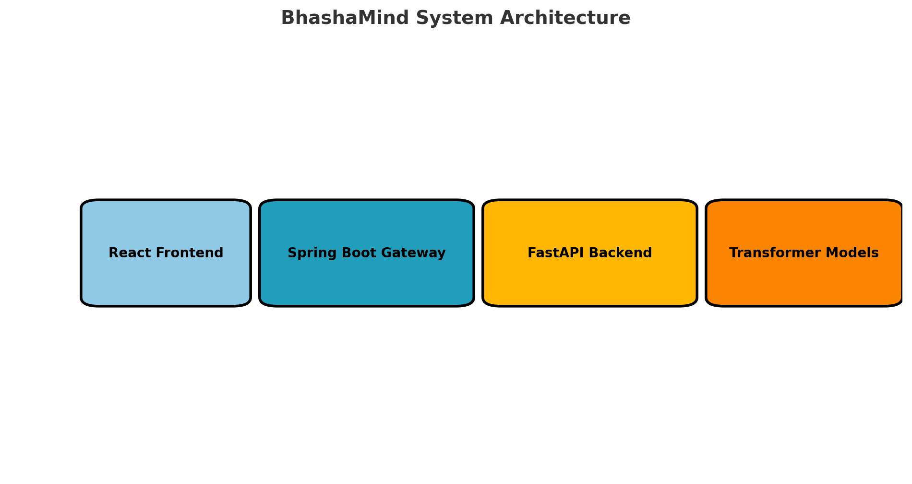

# BhashaMind: A Bengali Language Intelligence Platform


BhashaMind (ভাষাMind) is an open-source Bengali language processing prototype focused on **text summarization** and **zero-shot classification** using state-of-the-art deep learning and LLM technologies. It integrates a full-stack application built with **FastAPI**, **Spring Boot**, and **React**, designed for real-world applications.

---

## 🌟 Project Highlights

- 🔤 **Low-Resource Bengali NLP**: Tailored for Bengali, one of the least-resourced languages in NLP.
- 🧠 **Transformer-powered**: Uses multilingual LLMs like `xlm-roberta` and optionally fine-tuned `BanglaT5`.
- 🧩 **Microservices Architecture**: Spring Boot API gateway + FastAPI backend + React frontend.
- 🧪 **Full-stack Pipeline**: Data ingestion → Summarization/Classification → Evaluation → UI interaction.

---

## 🏗️ System Architecture



```plaintext
[React Frontend] <---> [Spring Boot API Gateway] <---> [FastAPI NLP Backend] <---> [Transformer Models]
